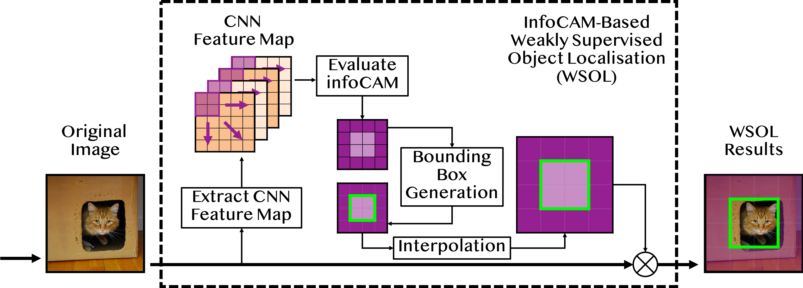

<h1 align="center">
    
     
    Rethinking Softmax with Cross-Entropy
     
</h1>

<h2 align="center">
Neural Network Classifier as Mutual Information Estimator
</h2>

  <a href="#mi-estimator">MI Estimator</a> •
  <a href="#pc-softmax">PC Softmax</a> •
  <a href="#InfoCAM">InfoCAM</a> •
  <a href="#credits">Credits</a> •
  <a href="#license">License</a>

    

<strong align="center">
In the paper, we show the connection between mutual information and softmax
classifier through variational form of mutual information. The 
connection explains the rational behind softmax cross-entropy from 
information-theoretic perspective, which brings a new insight to 
understand the classifiers. We utilise the connection between 
classification and mutual information to improve the weakly-supervised 
object localisation task. To this end, we propose a new way to 
compute the classification activation map, which is based on the 
difference between PMIs. 

This repository includes all the experimental implementation. We will 
also provide the giant pretrained models in the form of Google-Drive 
links if the paper is accepted. We will not release them due to 
the anonymous peer-review requirement. 
</strong>

## MI Estimator
In the paper, we prove that classification neural networks that 
optimise their weights to minimise the softmax cross-entropy are 
equivalent to the ones that maximise mutual information between 
inputs and labels with the balanced datasets. This repository 
includes the implementation for evaluating the effectiveness of 
classification mutual information estimator via synthetic 
datasets. We also show the balanced dataset assumption can be 
relaxed by modifying the traditional softmax to the 
Probability-Correct (PC) softmax. This repository also contains 
implementation for evaluating mutual information with PC-softmax
on the synthetic dataset. 

## PC Softmax
We modify the traditional softmax to the 
Probability-Correct (PC) softmax. This repository contains 
implementation for demonstrating PC-softmax can improve a large
margin than the traditional softmax for the average of the per-class 
classification accuracy. We experiment on two datasets: MNIST and
CUB-200-2011. In terms of the accuracy value merely, we achieve a new 
state-of-art of the micro classification accuracy 
(ours: 89.73; previous: 89.6) on CUB-200-2011. 

## InfoCAM 
We propose infoCAM: Informative Class Activation Map, which 
highlights regions of the input image that are the most relevant to a 
given label based on differences in information. The activation 
map helps localise the target object in an image. We in this 
repository show the effectiveness of the informative-theoretic 
approach than the traditional CAM. 

    

## Credits
This repository uses the following implementations: 
- [Fine-Grained Inception-V3](https://github.com/richardaecn/cvpr18-inaturalist-transfer)
- [ADL](https://github.com/junsukchoe/ADL/tree/master/Pytorch)
- [PyTorch-Example](https://github.com/pytorch/examples/tree/master/mnist)

## Licence
[CC-BY-4.0](https://choosealicense.com/licenses/cc-by-4.0/)

